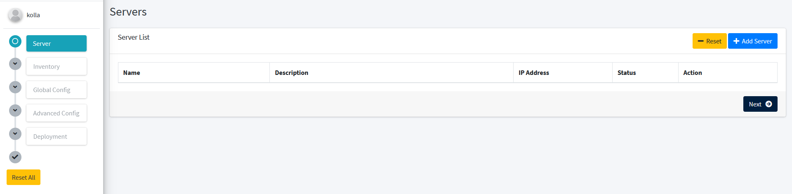

The installer menu is used to start deployment. On this menu you can select which machine will use for controller node, compute node and more.

To start deployment go to Installer menu.

From this page, you can select which machine to deploy. From this entry `Hujan` will automaticaly create inventory list.

After that select save server and next to inventory page. On this page you can select the server role, which will be added to `kolla-ansible` inventory.

Click on `Add Inventory`.

Click `Save Inventory` and next to `Globals Configuration` menu.

On `Global Configuration` menu you can customize your openstack configuration base on [globals.yml](https://github.com/openstack/kolla-ansible/blob/master/etc/kolla/globals.yml) from `kolla-ansible`. Then click `deploy`.

