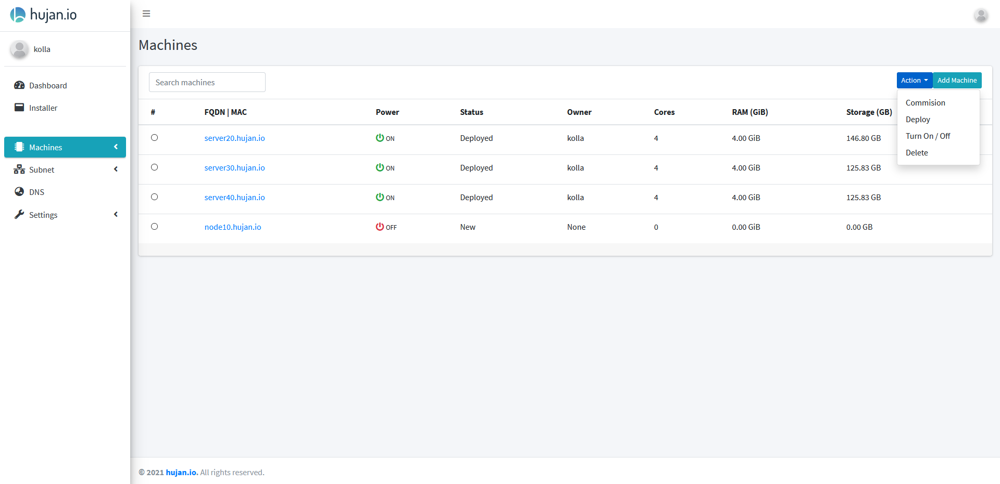
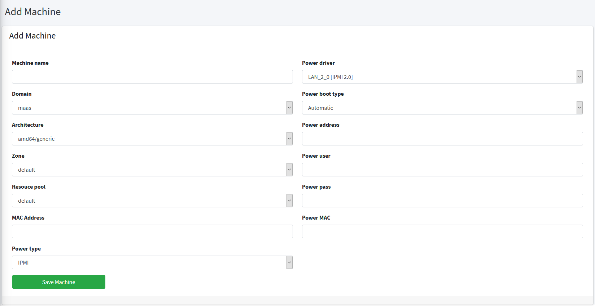
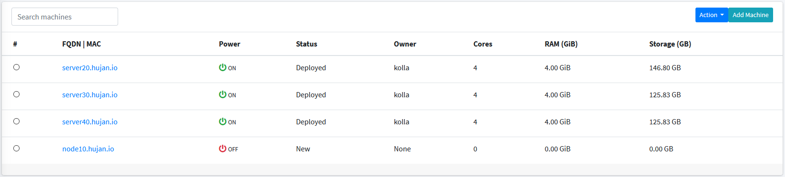

**Hujan** provide some MAAS functionalities, such as add machine, deploy and delete.

## Add Machine

To Add machine navigate to `Machines` then select `Add Machine`. 

  
For now, `Hujan` just support `IPMI` for the power type.

if you use `KVM` or you want to deploy your openstack in lab environment, you can use `vbmc` to emulate `BMC` functionalaties.

Fill the machine detail, then select save machine. And your machine is ready to be deploy.

